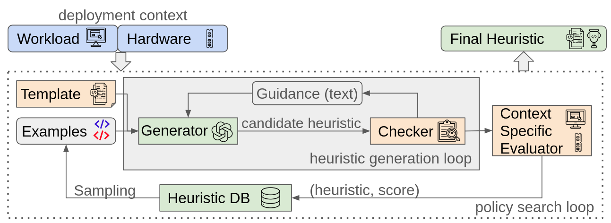

# PolicySmith
This repository contains the code for [PolicySmith](https://arxiv.org/abs/2510.08803), a system that discovers *heuristics* (i.e., code) for systems using LLMs and evolutionary search. This README will use the example of caching to demonstrate how to use PolicySmith; this codebase is extensible to support your task(s)



## Setup
+ Clone dependencies: `git submodule update --init`
+ [Install MongoDB](https://www.mongodb.com/docs/manual/tutorial/install-mongodb-on-ubuntu/) on your machine.
+ Install Python libraries: `pip3 install google-genai openai pymongo`.
+ Create a file called `api_key.py` and populate it with the following:
```py
GEMINI_API_KEY="<<secret_key_here>>"
OPENAI_API_KEY="<<secret_key_here>>"
MONGO_CONNECTION_STRING="mongodb://localhost:27017"
```

## Browse results from our HotNets 2025 paper
+ Go through `./hotnets_results` to explore the caching results described in the HotNets paper.
+ You can view the C++ source of the heuristics discovered (PS-A, PS-B, PS-X, etc.), reproduce the boxplots in the paper.

## Running policysmith
+ Follow the instructions in `webcache/README.md` to run PolicySmith for caching. Well documented.
+ [Experimental] `tcp_cc/bpf_scaffolding` contains the setup to evolve TCP congestion control policies in the Linux kernel with PolicySmith. Experimental / not very well documented yet.

## Extending PolicySmith
To use PolicySmith for your task:
+ create a new directory called (e.g. `./cpu_scheduling`).
+ Inside this directory, create a file called `./cpu_scheduling/interface.py` that subclasses `EvolveInterface` abstract class from `./Evolve.py`.
+ Look at the interface of `webcache` for more details / inspiration on what this should look like.
+ Profit?

## Reference
```
@article{dwivedula2025policysmith,
      title={Man-Made Heuristics Are Dead. Long Live Code Generators!}, 
      author={Dwivedula, Rohit and Saxena, Divyanshu and Akella, Aditya and Chaudhuri, Swarat and Kim, Daehyeok},
      year={2025},
      eprint={2510.08803},
      archivePrefix={arXiv},
      primaryClass={cs.OS},
      url={https://arxiv.org/abs/2510.08803}, 
      note = {arXiv:2510.08803 [cs.OS]}
}
```
